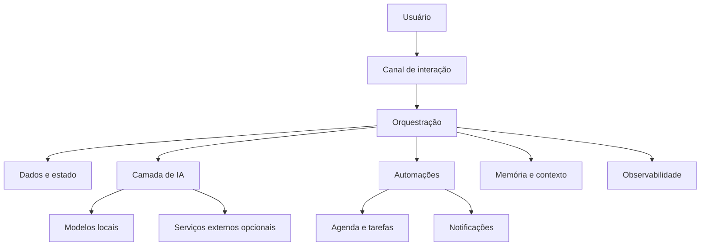

# Runa

Runa é um projeto de assistente pessoal multimodal criado para unir conversa, memória, automação e execução prática em um único sistema.

O projeto nasceu com foco em uso pessoal e operação local ou híbrida. A ideia é que a Runa possa acompanhar contexto, entender rotinas, executar ações autorizadas e manter continuidade entre interações sem depender de um único modelo de IA ou de um único canal.

## Estado do projeto

A Runa está em desenvolvimento ativo. O foco atual está na consolidação do núcleo conversacional, memória, identidade, segurança, agenda, lembretes, observabilidade e recuperação antes da expansão para voz, imagem, casa inteligente e comportamento proativo.

## Capacidades

Entre as capacidades previstas e em desenvolvimento estão:

- conversação em linguagem natural;
- agenda, tarefas e lembretes;
- contexto persistente e memória seletiva;
- múltiplos usuários e relações familiares;
- automações pessoais;
- modelos de IA locais;
- reconhecimento de fala e interpretação de imagens;
- síntese de voz;
- observabilidade e autorrecuperação;
- integração futura com casa inteligente;
- comportamento proativo dentro de limites explícitos de autorização.

## Arquitetura em alto nível

A documentação pública mostra somente a arquitetura conceitual. Credenciais, identificadores reais, endereços de rede, dados pessoais, topologia de produção e detalhes operacionais permanecem fora deste repositório.

## Tecnologias avaliadas ou utilizadas

- **Raspberry Pi / Linux:** infraestrutura principal;
- **Docker:** isolamento e execução de serviços;
- **n8n:** orquestração de fluxos e automações;
- **PostgreSQL / Supabase:** persistência estruturada;
- **Baileys:** integração com WhatsApp;
- **Ollama:** execução de modelos locais;
- **Whisper:** reconhecimento de fala;
- **Piper:** síntese de voz local;
- **Obsidian:** camada planejada de conhecimento interligado e memória associativa.

A composição técnica pode mudar conforme o projeto amadurece.

## Segurança e privacidade

Este repositório público não deve conter senhas, tokens, chaves de API, credenciais, arquivos `.env`, números de telefone reais usados na operação, IDs privados de usuários, endereços internos de infraestrutura, dados de clientes, logs de produção, dumps de banco ou mensagens privadas.

Mais informações estão em [`SECURITY.md`](SECURITY.md).

## Código e distribuição

Este repositório é a área pública de apresentação e documentação da Runa. O núcleo de produção, workflows completos, scripts operacionais e configurações reais são mantidos separadamente.

Quando versões destinadas a terceiros estiverem prontas, a distribuição poderá ocorrer por pacotes, containers ou instaladores oficiais, sem exigir a publicação integral do código-fonte de produção.

## Direitos autorais e uso comercial

**Copyright © 2026 Pedro Facundo. Todos os direitos reservados.**

A visibilidade pública deste repositório não concede automaticamente autorização para copiar, redistribuir, sublicenciar, vender ou explorar comercialmente materiais próprios da Runa. Qualquer uso comercial depende de autorização específica do titular dos direitos.

Consulte [`NOTICE.md`](NOTICE.md) para detalhes.

## Documentação

- [`docs/VISION.md`](docs/VISION.md): visão de longo prazo;
- [`docs/ARCHITECTURE.md`](docs/ARCHITECTURE.md): arquitetura pública em alto nível;
- [`docs/ROADMAP.md`](docs/ROADMAP.md): direção de desenvolvimento;
- [`docs/REFERENCES.md`](docs/REFERENCES.md): referências técnicas externas.

## Sobre este repositório

Esta é a base pública limpa da Runa. O objetivo é documentar a evolução do projeto sem misturar informações privadas ou operacionais do ambiente real.
