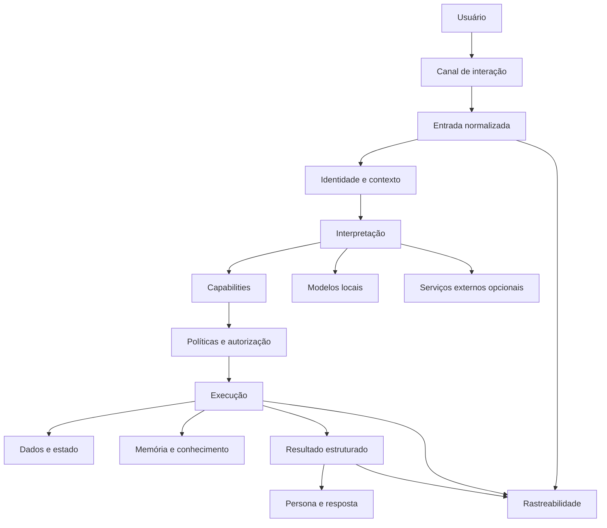

# Runa

Runa é um projeto de assistente pessoal multimodal criado para unir conversa, memória, automação e execução prática em um único sistema.

O projeto nasceu com foco em uso pessoal e operação local ou híbrida. A ideia é que a Runa acompanhe contexto, entenda rotinas, execute ações autorizadas e mantenha continuidade entre interações sem depender de um único modelo de IA ou de um único canal.

## Estado do projeto

A Runa está em desenvolvimento ativo.

Dois marcos observacionais do Runtime já foram implantados: correlação técnica estável das execuções e um **Execution Ledger em shadow mode** para registrar eventos técnicos comprováveis com metadados mínimos.

Essas camadas aumentam rastreabilidade e diagnóstico sem governar autorização, decidir ações ou alterar o conteúdo funcional entregue ao usuário.

O foco atual combina:

- confiabilidade do núcleo conversacional;
- identidade, autorização e privacidade;
- rastreabilidade e recuperação;
- Runtime modular de capabilities;
- preparação de memória persistente;
- evolução da persona;
- novas capacidades recorrentes de forma controlada.

Veja [`docs/STATUS.md`](docs/STATUS.md) para o estado público mais recente.

## Capacidades e direções

Entre as capacidades presentes, planejadas ou em desenvolvimento estão:

- conversação em linguagem natural;
- agenda, tarefas e lembretes;
- contexto persistente e memória seletiva;
- múltiplos usuários e relações familiares;
- automações pessoais;
- modelos de IA locais;
- rastreabilidade de execução;
- obrigações e lembretes recorrentes;
- reconhecimento de fala e interpretação de imagens;
- síntese de voz;
- observabilidade e autorrecuperação;
- integração futura com casa inteligente;
- comportamento proativo dentro de limites explícitos de autorização.

## Arquitetura em alto nível

A arquitetura evolui gradualmente. Tracing e Execution Ledger já operam de forma observacional; Capability Registry, Policy Engine e futuras ações governadas entram progressivamente depois de validação e comparação com o comportamento existente.

A documentação pública mostra somente a arquitetura conceitual. Credenciais, identificadores reais, endereços de rede, dados pessoais, topologia de produção e detalhes operacionais permanecem fora deste repositório.

## Princípios atuais

### Observabilidade antes de governança

Antes de permitir que um novo runtime decida ações reais, a Runa primeiro precisa conseguir acompanhar a execução e comparar resultados com o sistema já validado.

### Confirmação não é autorização

Uma pessoa confirmar uma ação não concede automaticamente acesso a um recurso protegido.

### Privilégio precisa de origem confiável

Campos, linguagem natural, modelos de IA e payloads arbitrários não devem elevar privilégios. Integrações que transportam contexto administrativo precisam de uma trust boundary autenticada.

### Resultado antes da persona

A identidade narrativa da Runa pode mudar tom e linguagem, mas não transforma falha em sucesso nem altera uma decisão de autorização.

### Uma pessoa pode ter vários canais, mas merge não é automático

A futura reconciliação entre múltiplos canais deve exigir prova de posse e política explícita. Nome, e-mail ou outro identificador coincidente não é autorização suficiente por si só.

### Obrigações recorrentes não são gastos realizados

O projeto está preparando uma representação própria para obrigações futuras e lembretes recorrentes, sem registrar automaticamente um compromisso futuro como gasto já ocorrido ou tarefa comum.

## Tecnologias avaliadas ou utilizadas

- **Raspberry Pi / Linux:** infraestrutura principal;
- **Docker:** isolamento e execução de serviços;
- **n8n:** orquestração de fluxos e automações;
- **PostgreSQL / Supabase:** persistência estruturada;
- **Baileys:** integração com WhatsApp;
- **Ollama:** execução de modelos locais;
- **Whisper:** reconhecimento de fala;
- **Piper:** síntese de voz local;
- **Obsidian:** camada planejada de conhecimento interligado e memória associativa.

A composição técnica pode mudar conforme o projeto amadurece.

## Segurança e privacidade

Este repositório público não deve conter senhas, tokens, chaves de API, credenciais, arquivos `.env`, números de telefone reais usados na operação, IDs privados de usuários, endereços internos de infraestrutura, dados de clientes, logs de produção, dumps de banco ou mensagens privadas.

A arquitetura também separa interpretação de autorização: um modelo pode ajudar a entender uma solicitação, mas não deve conceder privilégio nem contornar políticas determinísticas.

Mais informações estão em [`SECURITY.md`](SECURITY.md).

## Código e distribuição

Este repositório é a área pública de apresentação e documentação da Runa. O núcleo de produção, workflows completos, scripts operacionais e configurações reais são mantidos separadamente.

Quando versões destinadas a terceiros estiverem prontas, a distribuição poderá ocorrer por pacotes, containers ou instaladores oficiais, sem exigir a publicação integral do código-fonte de produção.

## Direitos autorais e uso comercial

**Copyright © 2026 Pedro Facundo. Todos os direitos reservados.**

A visibilidade pública deste repositório não concede automaticamente autorização para copiar, redistribuir, sublicenciar, vender ou explorar comercialmente materiais próprios da Runa. Qualquer uso comercial depende de autorização específica do titular dos direitos.

Consulte [`NOTICE.md`](NOTICE.md) para detalhes.

## Documentação

- [`docs/STATUS.md`](docs/STATUS.md): estado público mais recente;
- [`docs/VISION.md`](docs/VISION.md): visão de longo prazo;
- [`docs/ARCHITECTURE.md`](docs/ARCHITECTURE.md): arquitetura pública em alto nível;
- [`docs/ROADMAP.md`](docs/ROADMAP.md): direção de desenvolvimento;
- [`docs/REFERENCES.md`](docs/REFERENCES.md): referências técnicas externas.

## Sobre este repositório

Esta é a base pública limpa da Runa. O objetivo é documentar a evolução do projeto sem misturar informações privadas ou operacionais do ambiente real.
