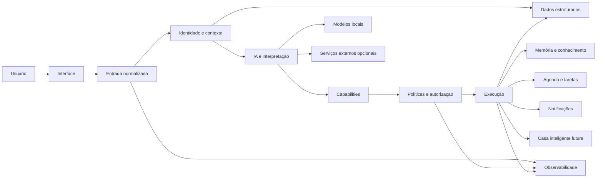

# Arquitetura pública da Runa

Este documento descreve a Runa em alto nível. Ele não representa a topologia real de produção e não contém endereços, credenciais, identificadores privados ou detalhes operacionais do ambiente.

## Visão geral

A arquitetura é organizada em camadas para separar entrada, interpretação, identidade, autorização, memória, execução e observabilidade.

## Interface e normalização

A camada de interface recebe solicitações do usuário. O projeto começou por mensageria, mas foi pensado para aceitar outras formas de interação no futuro, incluindo voz, imagens e documentos.

Modalidades diferentes devem ser normalizadas antes de entrar no mesmo núcleo. Isso evita criar regras diferentes de segurança e execução para cada canal.

## Identidade e contexto

Antes de uma ação, a Runa precisa distinguir quem está falando, qual recurso está sendo solicitado e qual contexto pode ser utilizado.

Relações pessoais conhecidas não significam automaticamente permissão para acessar dados de outra pessoa.

## IA e interpretação

A camada de IA transforma linguagem natural em intenção, extrai contexto e auxilia na geração de respostas. A arquitetura não deve depender obrigatoriamente de um único modelo.

Modelos locais são priorizados quando oferecem qualidade suficiente. Serviços externos podem atuar como capacidade complementar ou fallback quando apropriado.

A IA pode auxiliar interpretação, mas decisões de autorização e confirmação de efeitos reais devem permanecer em camadas determinísticas sempre que possível.

## Capabilities

As ações da Runa evoluem para capacidades descritas por contratos claros.

Uma capability pode declarar, em alto nível:

- o que faz;
- quais dados recebe;
- quais permissões exige;
- qual o nível de risco;
- se precisa de confirmação;
- se possui efeitos externos;
- quais interfaces podem utilizá-la.

Essa abordagem permite que texto, voz e futuras interfaces compartilhem a mesma regra de execução.

## Políticas e autorização

A camada de políticas avalia identidade, recurso, risco, permissão e necessidade de confirmação antes de ações sensíveis.

Confirmação e autorização são conceitos diferentes. Um usuário confirmar uma ação não concede automaticamente acesso a um recurso para o qual não possui permissão.

## Dados estruturados

Dados que exigem consistência, consulta objetiva e atualização transacional são armazenados em banco estruturado. Exemplos incluem agenda, tarefas, permissões, estados e registros operacionais.

## Memória e contexto

Memória não é tratada como simples armazenamento de todas as conversas. O objetivo é selecionar o que realmente precisa permanecer disponível no longo prazo.

Antes de persistir conhecimento durável, a arquitetura deve considerar proprietário, origem, visibilidade, sensibilidade, retenção e possíveis conflitos com informações anteriores.

Uma camada de conhecimento interligado poderá complementar o banco estruturado e permitir relações mais naturais entre pessoas, projetos, eventos, decisões e aprendizados, sem substituir o banco operacional.

## Execução

Automações executam ações concretas somente depois das validações necessárias.

Princípios incluem:

- evitar efeitos duplicados;
- manter rastreabilidade;
- persistir estado suficiente para recuperação;
- diferenciar retry de nova ação;
- exigir controles adicionais para operações sensíveis ou destrutivas;
- manter possibilidade de rollback ou reconciliação quando aplicável.

## Observabilidade

A Runa deve ser capaz de perceber indisponibilidades, mudanças de estado e falhas relevantes. O objetivo é facilitar diagnóstico e recuperação sem transformar qualquer falha secundária em indisponibilidade completa do sistema.

Além da saúde da infraestrutura, a evolução inclui rastrear o ciclo de uma solicitação de forma segura, permitindo relacionar entrada, decisão, ação e resposta sem armazenar conteúdo privado desnecessário.

## Persona

A identidade narrativa da Runa é aplicada sobre o resultado real de uma operação. Ela pode alterar tom e linguagem, mas não pode transformar uma falha em sucesso nem esconder limitações importantes do usuário.

## Segurança

A arquitetura pública não documenta:

- endereços reais de rede;
- portas expostas em produção;
- credenciais;
- nomes e IDs reais de usuários;
- detalhes de autenticação;
- caminhos internos do ambiente;
- dumps, logs ou payloads reais;
- topologia detalhada de produção.

Essas informações permanecem fora deste repositório.
