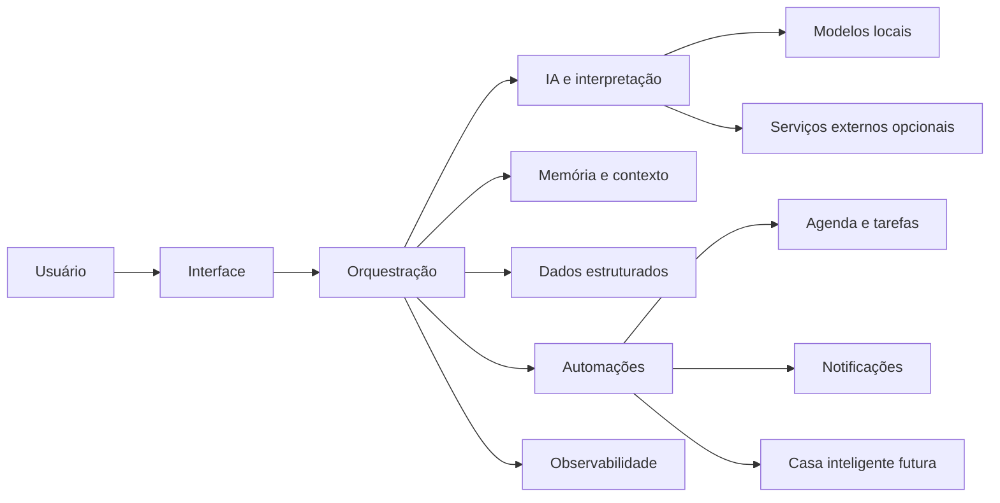

# Arquitetura pública da Runa

Este documento descreve a Runa em alto nível. Ele não representa a topologia real de produção e não contém endereços, credenciais, identificadores privados ou detalhes operacionais do ambiente.

## Visão geral

A arquitetura é organizada em camadas para separar entrada de mensagens, decisão, memória, execução e observabilidade.

## Interface

A camada de interface recebe solicitações do usuário. O projeto começou por mensageria, mas foi pensado para aceitar outras formas de interação no futuro, incluindo voz.

## Orquestração

A orquestração decide quais módulos precisam participar de cada solicitação. Ela conecta interpretação, dados, memória, automações e respostas.

## IA e interpretação

A camada de IA transforma linguagem natural em intenção, extrai contexto e auxilia na geração de respostas. A arquitetura não deve depender obrigatoriamente de um único modelo.

Modelos locais são priorizados quando oferecem qualidade suficiente. Serviços externos podem atuar como capacidade complementar ou fallback quando apropriado.

## Dados estruturados

Dados que exigem consistência, consulta objetiva e atualização transacional são armazenados em banco estruturado. Exemplos incluem agenda, tarefas, permissões, estados e registros operacionais.

## Memória e contexto

Memória não é tratada como simples armazenamento de todas as conversas. O objetivo é selecionar o que realmente precisa permanecer disponível no longo prazo.

Uma camada futura de conhecimento interligado poderá complementar o banco estruturado e permitir relações mais naturais entre pessoas, projetos, eventos, decisões e aprendizados.

## Automações

Automações executam ações concretas após validação de contexto e autorização. Operações sensíveis ou destrutivas devem exigir controles adicionais.

## Observabilidade

A Runa deve ser capaz de perceber indisponibilidades, mudanças de estado e falhas relevantes. O objetivo é facilitar diagnóstico e recuperação sem transformar qualquer falha secundária em uma indisponibilidade completa do sistema.

## Segurança

A arquitetura pública não documenta:

- endereços reais de rede;
- portas expostas em produção;
- credenciais;
- nomes e IDs reais de usuários;
- detalhes de autenticação;
- caminhos internos do ambiente;
- dumps, logs ou payloads reais;
- topologia detalhada de produção.

Essas informações permanecem fora deste repositório.
