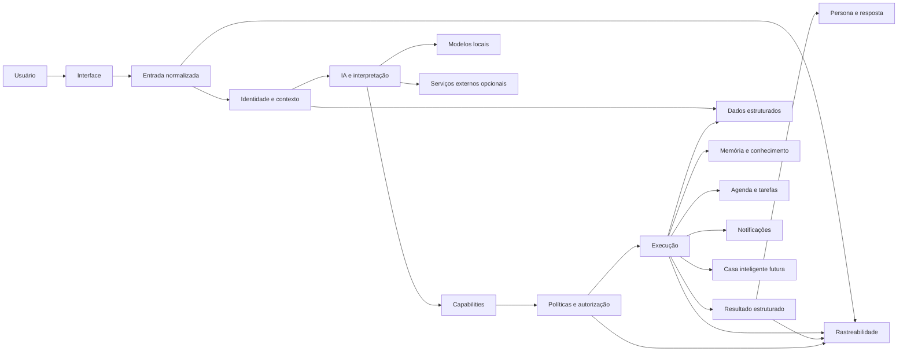

# Arquitetura pública da Runa

Este documento descreve a Runa em alto nível. Ele não representa a topologia real de produção e não contém endereços, credenciais, identificadores privados ou detalhes operacionais do ambiente.

## Visão geral

A arquitetura é organizada em camadas para separar entrada, interpretação, identidade, autorização, memória, execução, resultado e observabilidade.



## Interface e normalização

A camada de interface recebe solicitações do usuário. O projeto começou por mensageria, mas foi pensado para aceitar outras modalidades no futuro, incluindo voz, imagens e documentos.

Modalidades diferentes devem ser normalizadas antes de entrar no mesmo núcleo. Isso evita criar regras diferentes de segurança e execução para cada canal.

A normalização também é uma fronteira importante de rastreabilidade. Uma execução recebe correlação técnica interna para permitir diagnóstico sem alterar a experiência do usuário.

## Identidade e contexto

Antes de uma ação, a Runa precisa distinguir quem está falando, qual recurso está sendo solicitado e qual contexto pode ser utilizado.

Relações pessoais conhecidas não significam automaticamente permissão para acessar dados de outra pessoa.

Uma mesma pessoa pode futuramente usar múltiplos canais ou números. Isso não significa que dois cadastros devam ser mesclados automaticamente. Reconciliação de identidade exige prova de posse e política explícita.

## Trust boundaries

Dados recebidos de uma interface ou integração possuem níveis diferentes de confiança.

Princípios:

- linguagem natural não concede privilégio;
- um modelo de IA não concede privilégio;
- um campo em payload não deve ser tratado como administrativo apenas por estar presente;
- componentes que transportam contexto privilegiado precisam autenticar sua origem;
- ausência ou falha dessa autenticação deve resultar em tratamento conservador.

Os mecanismos concretos usados em produção não são documentados neste repositório público.

## IA e interpretação

A camada de IA transforma linguagem natural em intenção, extrai contexto e auxilia na geração de respostas. A arquitetura não depende obrigatoriamente de um único modelo.

Modelos locais são priorizados quando oferecem qualidade suficiente. Serviços externos podem atuar como capacidade complementar quando apropriado.

A IA pode ajudar a interpretar linguagem, mas decisões de autorização e confirmação de efeitos reais permanecem em camadas determinísticas sempre que possível.

## Capabilities

As ações da Runa evoluem para capacidades descritas por contratos claros.

Uma capability pode declarar o que faz, quais dados recebe, permissões, risco, necessidade de confirmação, efeitos externos, interfaces aceitas e garantias de idempotência e recuperação.

O Registry dessas capabilities entra gradualmente. O sistema primeiro observa e compara antes de permitir que essa camada governe ações reais.

## Políticas e autorização

A camada de políticas avalia identidade, recurso, risco, permissão e necessidade de confirmação antes de ações sensíveis.

Confirmação e autorização são conceitos diferentes. Um usuário confirmar uma ação não concede automaticamente acesso a um recurso para o qual não possui permissão.

O Policy Engine será introduzido progressivamente, começando em shadow mode antes de governar uma capability de baixo risco.

## Dados estruturados

Dados que exigem consistência, consulta objetiva e atualização transacional são armazenados em banco estruturado. Exemplos incluem agenda, tarefas, permissões, estados e registros operacionais.

### Obrigações recorrentes

Uma obrigação futura é conceitualmente diferente de um gasto já realizado e de uma tarefa comum.

A arquitetura está sendo preparada para representar regras recorrentes de forma própria, materializando ocorrências quando necessário e preservando idempotência. Essa capacidade ainda está em desenvolvimento privado e não deve ser interpretada como funcionalidade pública concluída.

## Memória e contexto

Memória não é tratada como armazenamento indiscriminado de todas as conversas. O objetivo é selecionar o que realmente precisa permanecer disponível no longo prazo.

Antes de persistir conhecimento durável, a arquitetura considera proprietário, origem, visibilidade, sensibilidade, retenção e possíveis conflitos com informações anteriores.

Uma camada de conhecimento interligado poderá complementar o banco estruturado sem substituir o banco operacional.

## Execução

Automações executam ações concretas somente depois das validações necessárias.

Princípios incluem evitar efeitos duplicados, manter rastreabilidade, persistir estado suficiente para recuperação, diferenciar retry de nova ação e manter rollback ou reconciliação quando aplicável.

## Resultado antes da persona

O resultado operacional deve existir antes da composição narrativa.

Isso permite representar sucesso, pendência, negação, falha, resultado parcial ou necessidade de reconciliação sem permitir que a persona modifique o que realmente aconteceu.

A identidade narrativa altera a forma de comunicação, não a verdade operacional.

## Observabilidade e rastreabilidade

A Runa deve perceber indisponibilidades, mudanças de estado e falhas relevantes. O objetivo é facilitar diagnóstico e recuperação sem transformar falha secundária em indisponibilidade completa do sistema.

### Tracing observacional

A arquitetura possui correlação técnica interna das execuções em modo observacional.

Esse tracing não aparece para o usuário, não concede autorização, não decide uma capability e não muda o resultado de negócio.

### Execution Ledger observacional

Um Execution Ledger dedicado também está implantado em `shadow mode`.

Ele registra somente eventos causais mínimos quando essas etapas podem ser comprovadas por uma fonte técnica adequada. O Ledger evita depender de texto integral ou payloads privados quando metadados forem suficientes para provar causalidade.

Tracing e Ledger formam a fundação observacional atual. Eles não governam ações.

Depois da estabilização dessa base, Registry e Policy avançam para governança gradual.

## Persona e audiência

A identidade narrativa da Runa é aplicada sobre o resultado real de uma operação. Ela pode alterar tom e linguagem, mas não transforma falha em sucesso nem esconde limitações importantes.

Usuários comuns e uma audiência administrativa autenticada podem receber níveis diferentes de detalhe. A seleção dessa audiência deve depender de identidade confiável, nunca de um campo arbitrário recebido da conversa.

## Segurança

A arquitetura pública não documenta endereços reais de rede, portas expostas, credenciais, identidades reais, mecanismos operacionais detalhados de autenticação, caminhos internos, dumps, logs, payloads ou topologia detalhada de produção.

## Sequência arquitetural atual

```text
Recovery e idempotência estáveis
        ↓
Tracing observacional
        ↓
Execution Ledger shadow
        ↓
Trust boundaries reforçadas
        ↓
Capability Registry shadow
        ↓
Policy Engine shadow
        ↓
Primeira capability read-only governada
        ↓
Expansão gradual para memória, voz e novas automações
```

Essa ordem reduz o risco de introduzir governança sem capacidade suficiente de explicar e comparar o que o sistema fez.
